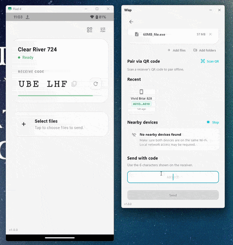

> [!NOTE]
> **Wisp** is a friendly fork of [Drift](https://github.com/vsamarth/drift) by
> Samarth Verma. Heavy ❤️ to the upstream project — Wisp diverges in UX
> direction (Android-first polish, QR code pairing, self-diagnose tooling) and runs its own
> rendezvous infrastructure so we don't lean on Drift's resources.

> [!WARNING]
> Wisp is still rough around the edges. If something breaks, feels confusing, or does not work on your device, please open an issue:
> https://github.com/vigov5/wisp/issues/new

<p align="center">
  
</p>

<h1 align="center">Wisp</h1>

<p align="center">
  <strong>AirDrop-like file sharing for any device, anywhere.</strong>
</p>

<p align="center">
  
</p>

Wisp is a free and open-source app for sending files directly between devices, built using [iroh](https://www.iroh.computer/).

It is designed to feel as simple as AirDrop, but without being limited to Apple devices or nearby-only transfers. Pick files, connect to another device, and send.

## Features

- **Send files between devices, near or far**
  Discover nearby devices on your local network, or connect using a 6-character pairing code.

- **Offline pairing via QR**
  No internet? Scan a QR code shown on the receiver to pair over the same Wi-Fi without going through the rendezvous server.

- **Direct transfer over a USB cable (Android)**
  Plug two Android phones together with a USB cable and send files directly over it — no Wi-Fi, no network, and no rendezvous server. Great when there's no shared network or you want a fast, fully offline path.

- **Send text and links, not just files**
  Share a snippet of text or a link straight across. The receiver can copy it to the clipboard or open the link in one tap.

- **Saved devices**
  After a successful transfer, the other device shows up in a "Recent" list so you can pick it again without re-scanning or re-typing a code. Give saved devices your own nicknames (pinned to their key). (Auto-approve / trusted-device flow is on the roadmap.)

- **Back up your identity**
  Export and restore your device's secret key, so you can move your Wisp identity to a new device or keep your saved-device relationships after a reinstall.

- **Resumable transfers**
  Connection died mid-transfer? Send the same files again and Wisp will resume from where the transfer stopped instead of starting over.

- **Open received files in one tap**
  When a transfer finishes, open any received file straight from the result screen, or jump to the exact folder it landed in — including a custom save folder you picked.

- **Change your mind while connecting**
  Still waiting to connect? Step back from the connecting screen to your draft to pick a different device or connection method, without re-selecting your files.

- **Cross-platform**
  Wisp currently provides builds for macOS, Windows, Linux, and Android. iOS support is planned.

- **End-to-end encrypted connections**
  Files are sent over an end-to-end encrypted peer-to-peer connection. Files are never stored in the cloud, and only the sender and receiver can read them.

- **Self-diagnose**
  A built-in Connection Test surfaces network, rendezvous, LAN, and permission issues with actionable hints when things go wrong.

- **Free and open source**
  Wisp is MIT-licensed and open to contributions. No ads, accounts, or limits on what you send.

## Installation

| Platform | Download |
| --- | --- |
| macOS | [Latest release →](https://github.com/vigov5/wisp/releases/latest) |
| Windows | [Latest release →](https://github.com/vigov5/wisp/releases/latest) |
| Linux | [Latest release →](https://github.com/vigov5/wisp/releases/latest) |
| Android | <a href="https://play.google.com/store/apps/details?id=dev.vigov5.wisp"></a> · [APK (sideload) →](https://github.com/vigov5/wisp/releases/latest) |
| iOS | Coming soon |

> [!TIP]
> **macOS:** Wisp is currently unsigned. If Gatekeeper blocks the app, you can remove the quarantine flag:
>
> ```sh
> xattr -rd com.apple.quarantine /Applications/Wisp.app
> ```

### Build from source

The Flutter app lives in [`flutter/`](flutter/).

See [`flutter/README.md`](flutter/README.md) for build instructions.

## Getting started

1. Choose or drop the files you want to send.
2. Pick a recipient — one of:
   - a nearby device discovered on your LAN,
   - the 6-character pairing code shown on the receiving device,
   - the QR code shown on the receiving device (scan it from the sender to pair offline, no internet needed), or
   - another Android phone connected to yours with a USB cable.
3. The receiver reviews the files and accepts the transfer.
4. Wisp sends the files directly to the other device.

## Contributing

Wisp is usable, but still early. Contributions, testing, bug reports, and UX feedback are welcome.

Some of the things planned next:

- [x] Resumable transfers for interrupted sessions
- [x] Remember recent devices for quick re-send
- [x] Self-diagnose connection test
- [x] Offline QR pairing
- [ ] Trusted devices with auto-approve (skip the accept prompt on known peers)
- [ ] Dark / light theme
- [ ] Keep Wisp listening in the background
- [ ] Set up app distribution through app stores and package managers
- [ ] Add iOS support

## License

Wisp is licensed under the MIT License. See [`LICENSE`](LICENSE). The original
copyright (Drift, Samarth Verma) is preserved alongside the Wisp fork's
copyright per MIT's notice requirement.
